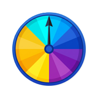

[🇺🇸 English](README.md) | [🇵🇹 Português](docs/README.pt.md)

# Event Prize Wheel 🎡

<div align="center">
  
</div>
<br/>

**Event Prize Wheel** is a modern, gamified Progressive Web App (PWA) perfect for tech fairs, marketing events, and showcases. It features a fully customizable "Spin to Win" wheel of fortune with built-in social media gating—requiring users to follow your social channels before they can play!

## ✨ Features & Functionality

- **Gamification:** A beautiful, physics-based spinning wheel with customizable prizes, sounds, and particle effects.
- **Social Gating:** Built-in modal that verifies if a user has followed your chosen social networks (Instagram, Facebook, YouTube) before unlocking the wheel.
- **PWA Ready:** Installable on iOS and Android straight from the browser. It behaves like a native app (fullscreen, no URL bar) and works entirely offline once cached!
- **Sleek UI:** Crafted with React, Tailwind CSS, and Framer Motion for buttery-smooth animations and a captivating, glowing aesthetic.
- **QR Code Generator:** Generates on-the-fly QR codes for your social links so users can simply scan the screen with their phones to follow you.

## 🚀 Step-by-Step Setup Guide

Follow these detailed instructions to clone, install, configure, and preview the project on your local machine.

### 1. Prerequisites
Before you begin, ensure you have the following installed:
- **Node.js** (v16.0 or higher) - [Download here](https://nodejs.org/)
- **Git** - [Download here](https://git-scm.com/)
- A code editor like [VS Code](https://code.visualstudio.com/)

### 2. Clone the Repository
Open your terminal or command prompt and run the following command to download the project:
```bash
git clone https://github.com/yourusername/event-prize-wheel.git
```
Navigate into the project directory:
```bash
cd event-prize-wheel
```

### 3. Install Dependencies
Install all the required packages (like React, Tailwind, Framer Motion) by running:
```bash
npm install
```

### 4. Run the Development Server
To see the project live on your machine, start the Vite development server:
```bash
npm run dev
```
The terminal will display a local URL (usually `http://localhost:5173`). Open this URL in your web browser to view the application in action.

## 🛠 Detailed Configuration

You can easily adapt this template to your own brand and event.

### Customizing the Wheel & Prizes
1. Open `src/components/PrizeWheel.jsx`.
2. Locate the `PRIZES` array.
3. Modify the text, colors, and probabilities of the prizes. The wheel is dynamically drawn based on this array.

### Customizing Social Links & Gating
1. Open `src/components/SocialQRModal.jsx`.
2. Locate the `SOCIAL_CONFIG` object.
3. Update the `url` fields with the links to your actual social media profiles (e.g., `https://instagram.com/yourpage`).
4. You can also toggle which platforms are `required: true` (the user must follow them to spin) or `required: false` (optional).

### Branding & Assets
- **Logo and Icons:** Replace the images in the `public/` directory (`icon-192.png`, `icon-512.png`) with your own event logos. Keep the same filenames or update `index.html` and `manifest.json` accordingly.
- **Colors:** The main glowing background and UI colors are defined using Tailwind utility classes in `src/pages/Home.jsx` and the canvas logic in `src/components/BurningBackground.jsx`.

## 📦 Building for Production

When you are ready to deploy the application to a live server (like Vercel, Netlify, or GitHub Pages), run:
```bash
npm run build
```
This will create a `dist` folder containing the optimized, minified production build of your app.

## 📜 License

This project is open-source and available under the [MIT License](LICENSE). Feel free to use it for your own events, hack it, and improve it!
